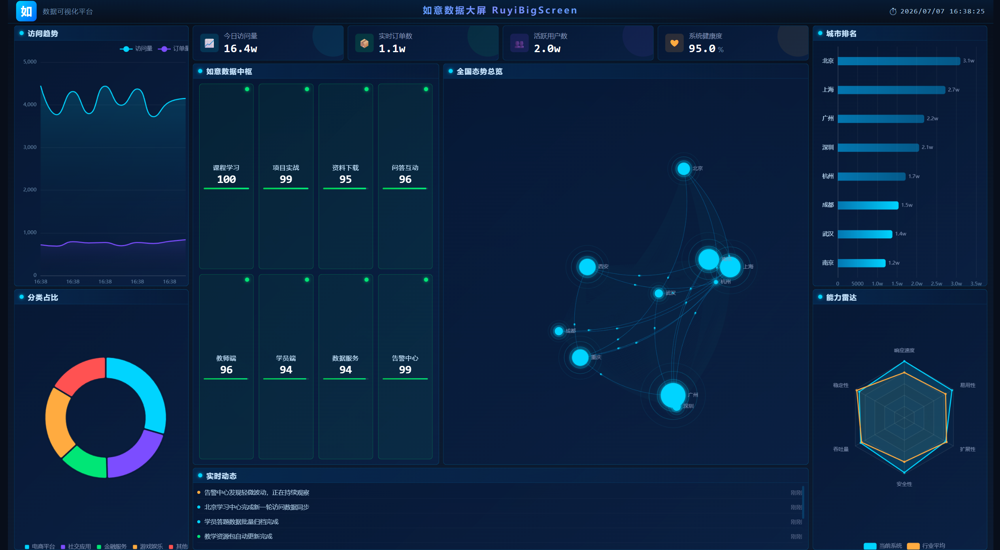

# 如意数据大屏 RuyiBigScreen

一个公开开源的教学型数据可视化大屏项目，帮助学生和初学者从 0 到 1 学习如何动手制作数据可视化大屏。

## 效果预览



## 复现步骤

从零开始，三步跑起来：

```bash
# 1. 克隆项目
git clone git@github.com:hosimo-ui/RuYiBigScreen.git
cd RuYiBigScreen

# 2. 安装依赖
npm install

# 3. 启动开发服务器
npm run dev
```

浏览器自动打开 `http://localhost:10001`，即可看到数据大屏。页面数据会模拟实时变化，无需任何后端。

关闭项目：在终端按 `Ctrl + C` 停止开发服务器。

### 环境要求

- Node.js >= 18
- npm >= 9

---

## 页面内容

打开后看到的大屏包含：

| 区域     | 内容                                                |
| -------- | --------------------------------------------------- |
| 顶部     | 标题"如意数据大屏 RuyiBigScreen" + 实时时钟          |
| 中上     | 4 个核心指标卡片（访问量、订单数、活跃用户、健康度） |
| 中间靠左 | 如意数据中枢（8 个业务节点，状态实时变化）           |
| 中间靠右 | 全国态势总览（城市散点 + 连线动效）                  |
| 左侧     | 访问趋势折线图 + 分类占比饼图                        |
| 右侧     | 城市排名柱状图 + 能力雷达图                          |
| 底部     | 实时动态告警列表（每 4 秒新增一条）                  |

---

## 开发命令

| 命令                   | 说明                        |
| ---------------------- | --------------------------- |
| `npm run dev`          | 启动开发服务器（端口 10001） |
| `npm run build`        | 生产构建（输出到 dist/）    |
| `npm run preview`      | 预览生产构建                |
| `npm run lint`         | ESLint 代码检查             |
| `npm run format`       | Prettier 格式化             |
| `npm run test`         | 运行单元测试                |
| `npm run test:e2e`     | 运行 E2E 测试               |
| `npm run type-check`   | TypeScript 类型检查         |

---

## 从 mock 切换到真实 API

默认使用内置的实时 mock 数据。要切换到后端真实数据，修改项目根目录的 `.env`：

```env
# 改为 api 模式
VITE_DATA_SOURCE=api
# 填入你的后端地址
VITE_API_BASE_URL=http://your-api-server.com/api
```

无需修改任何组件代码，重启 `npm run dev` 即可生效。

---

## 技术栈

| 技术        | 用途       |
| ----------- | ---------- |
| Vue 3       | 前端框架   |
| Vite 6      | 构建工具   |
| TypeScript  | 类型安全   |
| ECharts 5   | 图表渲染   |
| Pinia 2     | 状态管理   |
| Axios       | HTTP 请求  |
| MSW 2       | Mock 服务  |
| Vitest 2    | 单元测试   |
| Playwright  | E2E 测试   |
| ESLint 8    | 代码规范   |
| Prettier 3  | 代码格式化 |
| Stylelint   | 样式规范   |

---

## 项目结构

```
RuyiBigScreen/
├── public/                          # 静态资源（含 MSW Service Worker）
├── images/                          # 文档素材（效果图等）
├── src/
│   ├── app/                         # 应用入口
│   │   ├── App.vue
│   │   └── main.ts
│   ├── components/                  # 通用组件
│   │   ├── BasePanel.vue            # 面板容器
│   │   ├── MetricCard.vue           # 指标卡片
│   │   └── ScreenHeader.vue         # 顶部标题栏
│   ├── charts/                      # 图表组件
│   │   ├── LineTrendChart.vue       # 访问趋势折线图
│   │   ├── BarRankingChart.vue      # 城市排名柱状图
│   │   ├── PieStatusChart.vue       # 分类占比饼图
│   │   ├── RadarAbilityChart.vue    # 能力雷达图
│   │   ├── MapOverviewChart.vue     # 全国态势总览
│   │   └── DataHubChart.vue         # 如意数据中枢
│   ├── views/
│   │   └── DashboardView.vue        # 主视图
│   ├── layouts/
│   │   └── BigScreenLayout.vue      # 大屏布局
│   ├── services/                    # 数据访问层
│   │   ├── http.ts                  # Axios 实例
│   │   ├── dashboardService.ts      # 数据服务
│   │   └── dataSource.ts            # 数据源切换（mock/api）
│   ├── mocks/                       # Mock 数据层
│   │   ├── browser.ts               # MSW 启动
│   │   ├── handlers.ts              # MSW 请求处理器
│   │   ├── dashboardMock.ts         # 初始 mock 数据
│   │   └── realtimeDashboardSimulator.ts  # 实时模拟器
│   ├── stores/
│   │   └── dashboardStore.ts        # Pinia 状态
│   ├── utils/
│   │   ├── format.ts                # 格式化工具
│   │   └── resize.ts                # 大屏自适应缩放
│   ├── logs/
│   │   └── logger.ts                # 统一日志
│   ├── types/
│   │   └── dashboard.ts             # 类型定义
│   ├── styles/
│   │   └── global.css               # 全局样式
│   └── tests/
│       ├── unit/                    # 单元测试（23 个用例）
│       └── e2e/                     # E2E 测试（2 个用例）
├── index.html
├── package.json
├── vite.config.ts
├── vitest.config.ts
├── playwright.config.ts
├── tsconfig.json
├── .env.example                     # 环境变量模板
├── .eslintrc.cjs
├── .prettierrc
└── .stylelintrc.json
```

---

## 架构设计

### 数据流

```
组件 ← Pinia Store ← dashboardService ← dataSource
                                              ├── mock → 实时模拟器
                                              └── api  → Axios → 后端
```

### 实时模拟机制

`src/mocks/realtimeDashboardSimulator.ts` 基于帧计数器驱动，每 2 秒生成下一帧数据：

| 数据模块      | 刷新频率  | 变化规则                                  |
| ------------- | --------- | ----------------------------------------- |
| 指标卡        | 每 2 秒   | 访问量递增，用户数浮动，健康度 95~99.9    |
| 访问趋势      | 每 4 秒   | 滑动窗口追加新点，保留 10 个              |
| 实时动态      | 每 4 秒   | 新增一条消息，保留 8 条                   |
| 数据中枢      | 每 2 秒   | 8 个节点 value 微调，status 联动          |
| 城市排名      | 每 10 秒  | 各城市递增后重排                          |
| 分类占比      | 每 12 秒  | 各分类微调，总和恒为 100%                 |
| 能力雷达      | 每 30 秒  | 各维度 ±1~3 分                            |

### 关键设计原则

- **组件不直接读 mock 文件** — 所有数据通过 `services/` 层获取
- **mock / api 一键切换** — 改变环境变量即可
- **实时逻辑不在组件里** — 模拟器独立模块，Store 只负责调度

---

## 测试结果

```
✅ 单元测试：23/23 通过
✅ E2E 测试： 2/2  通过
✅ ESLint：   零错误
✅ 构建：     成功
```

---

## License

MIT
